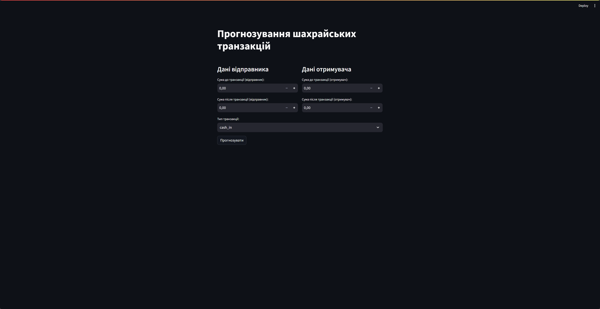

# Модель виявлення шахрайства


Ця самостійна робота реалізує модель виявлення шахрайства з використанням машинного навчання. Модель передбачає, чи є транзакція шахрайською на основі історичних даних транзакцій. Проект складається з двох основних частин:
* навчання моделей і надання прогнозів через веб-додаток за допомогою Streamlit.

## Огляд

1. **train_models.ipynb**: Цей Jupyter Notebook обробляє попередню обробку набору даних, навчає кілька моделей машинного навчання, оцінює їхню ефективність і зберігає найкращу модель для подальшого використання. Основні етапи:
   - **Завантаження даних**: З даного набору даних PaySim, включаючи очищення та підготовку.
   - **Аналіз даних**: Використання графіків і статистики для виявлення закономірностей у даних.
   - **Попередня обробка**: Перетворення категоріальних змінних у числові, нормалізація даних, обробка відсутніх значень.
   - **Розділення даних**: Розподіл даних на навчальну та тестову вибірки.
   - **Навчання моделей**: Використання різних алгоритмів (наприклад, логістичної регресії, дерев рішень, XGBoost) для навчання на основі підготовлених даних.
   - **Оцінка моделей**: Використання метрик (таких як точність, повнота, F1-міра) для визначення найкращої моделі.
   - **Збереження моделі**: Збереження найкращої моделі у файл для подальшого використання.

2. **main.py**: Цей скрипт слугує бекендом для веб-додатку, який дозволяє користувачам вводити деталі транзакцій і отримувати прогноз щодо ймовірності шахрайства. Основні етапи:
   - **Імпорт бібліотек**: Використання бібліотек для роботи з веб-додатком, а також для завантаження збереженої моделі.
   - **Створення веб-інтерфейсу**: Використання Streamlit для створення користувацького інтерфейсу, де користувач може вводити інформацію про транзакцію.
   - **Обробка запитів**: Отримання даних від користувача, попередня обробка введених даних, використання моделі для прогнозування.
   - **Вивід результатів**: Відображення ймовірності шахрайства на основі прогнозу моделі.

## Набір даних

### Про [набір даних](https://www.kaggle.com/datasets/ealaxi/paysim1/data)

Набір даних **PaySim** вирішує проблему браку публічно доступних фінансових наборів даних, зокрема в новій галузі мобільних фінансових транзакцій. Потреба в таких наборах даних є критично важливою для дослідників, особливо в сфері **виявлення шахрайства**. Однак, через природну приватність фінансових транзакцій, часто відсутні публічно доступні набори даних.

Для вирішення цієї проблеми симулятор PaySim генерує синтетичний набір даних, який імітує нормальну роботу транзакцій, вводячи при цьому зловмисну поведінку. Цей набір даних дозволяє оцінювати ефективність різних методів виявлення шахрайства.

### Структура набору даних

| Заголовок           | Опис                                                                                             |
|---------------------|--------------------------------------------------------------------------------------------------|
| `step`              | Представляє одиницю часу, де 1 крок дорівнює 1 годині. Загальна кількість кроків = 744 (симуляція 30 днів). |
| `type`              | Тип транзакції: `CASH-IN`, `CASH-OUT`, `DEBIT`, `PAYMENT` і `TRANSFER`.                         |
| `amount`            | Сума транзакції в місцевій валюті.                                                              |
| `nameOrig`         | Клієнт, який ініціював транзакцію.                                                              |
| `oldbalanceOrg`     | Початковий баланс до транзакції (не використовується для виявлення шахрайства).                 |
| `newbalanceOrig`    | Новий баланс після транзакції (не використовується для виявлення шахрайства).                   |
| `nameDest`          | Клієнт, який отримує транзакцію.                                                                 |
| `oldbalanceDest`    | Початковий баланс отримувача до транзакції (не використовується для виявлення шахрайства).      |
| `newbalanceDest`    | Новий баланс отримувача після транзакції (не використовується для виявлення шахрайства).        |
| `isFraud`           | Вказує, чи була транзакція здійснена шахрайським агентом.                                        |
| `isFlaggedFraud`    | Позначає незаконні спроби (наприклад, спроби перевести більше 200 000 в одній транзакції).     |

## Вимоги

Для запуску цього проекту переконайтеся, що у вас встановлені наступні пакети Python:

- pandas
- scikit-learn
- xgboost
- streamlit

Ви можете встановити необхідні пакети за допомогою pip:

```bash
pip install pandas scikit-learn xgboost streamlit
```

## Додаток
Додаток на базі [Streamlit](https://streamlit.io/) дозволяє користувачам вводити деталі фінансових транзакцій та отримувати прогнози щодо ймовірності шахрайства. Інтерфейс є інтуїтивно зрозумілим, що спрощує взаємодію з моделлю, забезпечуючи швидкий аналіз та оцінку транзакцій у реальному часі. Користувачі можуть візуально перевірити результати та отримати інсайти для ухвалення рішень щодо фінансової безпеки.

Як виглядає додаток:


Щоб запустити використай команду:
```bash
streamlit run main.py
```
